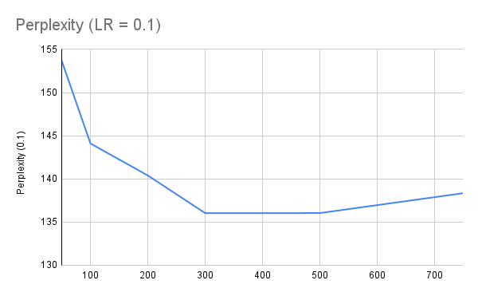

# Advanced NLP: Assignment 1
**Author:** *Hitesh Goel (20201115003)*

## Part 1: NNLM

### Declaring and Loading the model

To run the file:
```
python nnlm_main.py
```

To declare the model:
```
lm = NNLM(len(train_dataset.vocab), h1=500, h2=500).to(device)
```

To load the model:
```
lm = torch.load('nnlm.pth')
```

The model is available on OneDrive:
[link](https://iiitaphyd-my.sharepoint.com/:u:/g/personal/hitesh_goel_research_iiit_ac_in/ERJ8NB7UIyVFv6Y6Zfz5FL0B4cvFnXvdTaXGvMlLI2AkaQ?e=gRCqne)

### Perplexities
The perplexity files are uploaded on OneDrive:

[Test_file](https://iiitaphyd-my.sharepoint.com/:f:/g/personal/hitesh_goel_research_iiit_ac_in/EiLYDhAfZVBOovRKmgZ5liwBDwoQUUoes-r7wiE9WyuZiA?e=qyWdbF)

[Train_file](https://iiitaphyd-my.sharepoint.com/:f:/g/personal/hitesh_goel_research_iiit_ac_in/EiLYDhAfZVBOovRKmgZ5liwBDwoQUUoes-r7wiE9WyuZiA?e=qyWdbF)

### Hyperparameter finetuning (bonus)
The model was tuned over learning rates and hidden sizes.

Outputs are contained in the file: *ffn.txt*

*Graphs and visualisations:*





*most optimal parameters found:* lr=0.1	hs=300

## Part 2: LSTM

### Declaring and Loading the model

To run the file:
```
python lstm_main.py
```

To declare the model:
```
    lm = My_LSTM(len(train_dataset.vocab), embedding_matrix=train_dataset.embeddings,h1=300).to(device)

```

To load the model:
```
lm = torch.load('lstm.pth')
```

The model is available on OneDrive:
[link](https://iiitaphyd-my.sharepoint.com/:u:/g/personal/hitesh_goel_research_iiit_ac_in/EYW9FpRvpkFCuRR1wsV8PM0BgwTSL9Dxp0WZxwe7JP0SDw?e=aSMK1I)

### Perplexities
The perplexity files are uploaded on OneDrive:

[Test_file](https://iiitaphyd-my.sharepoint.com/:f:/g/personal/hitesh_goel_research_iiit_ac_in/EiLYDhAfZVBOovRKmgZ5liwBDwoQUUoes-r7wiE9WyuZiA?e=qyWdbF)

[Train_file](https://iiitaphyd-my.sharepoint.com/:f:/g/personal/hitesh_goel_research_iiit_ac_in/EiLYDhAfZVBOovRKmgZ5liwBDwoQUUoes-r7wiE9WyuZiA?e=qyWdbF)


## Part 3: TRANSFORMER

### Declaring and Loading the model

To run the file:
```
python transformer_main.py
```

To declare the model:
```
lm = TransformerDecoder(len(train_dataset.vocab),embedding_dim=300,num_layers=6,num_heads=6,max_seq_length=train_dataset.max_len, embedding_matrix=train_dataset.embeddings).to(device)

```

To load the model:
```
lm = torch.load('transformer.pth')
```

The model is available on OneDrive:
[link](https://iiitaphyd-my.sharepoint.com/:u:/g/personal/hitesh_goel_research_iiit_ac_in/EZfSx0sItq5Gjw-Mm27_10sB022kLN9yQSQAzqWYMw4R4Q?e=MIxZ7H)

### Perplexities
The perplexity files are uploaded on OneDrive:

[Test_file](https://iiitaphyd-my.sharepoint.com/:f:/g/personal/hitesh_goel_research_iiit_ac_in/EiLYDhAfZVBOovRKmgZ5liwBDwoQUUoes-r7wiE9WyuZiA?e=qyWdbF)

[Train_file](https://iiitaphyd-my.sharepoint.com/:f:/g/personal/hitesh_goel_research_iiit_ac_in/EiLYDhAfZVBOovRKmgZ5liwBDwoQUUoes-r7wiE9WyuZiA?e=qyWdbF)

### Analysis and Visualistions
As expected, LSTM outperforms a simple FFN model, but a transformer is superior to an LSTM model which is also indicated by the lower perplexity scores of the model. 

