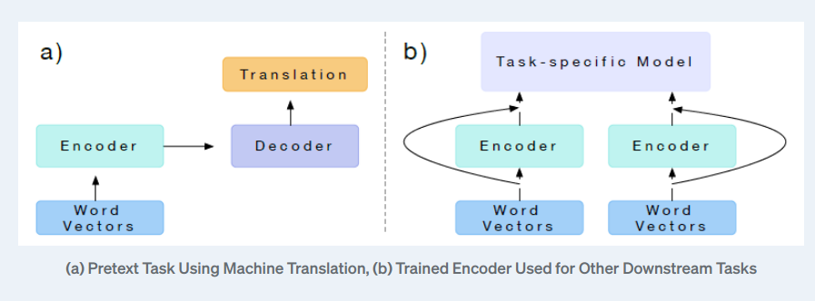
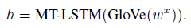
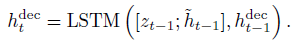
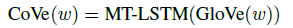
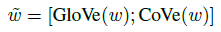
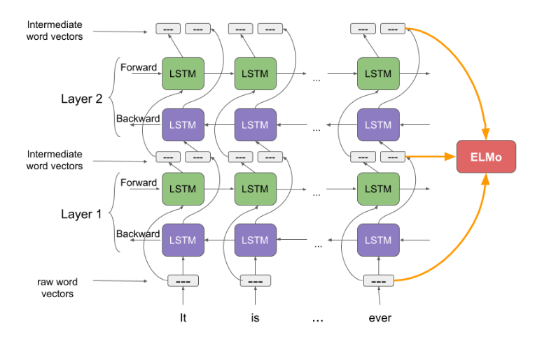
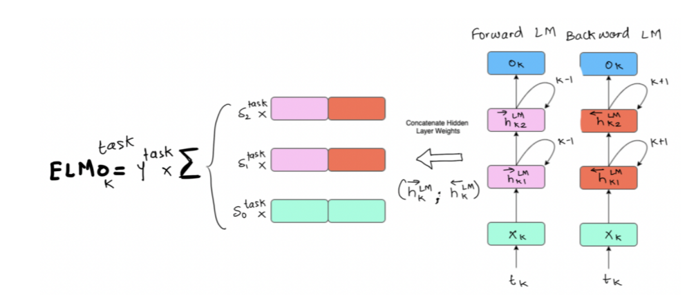
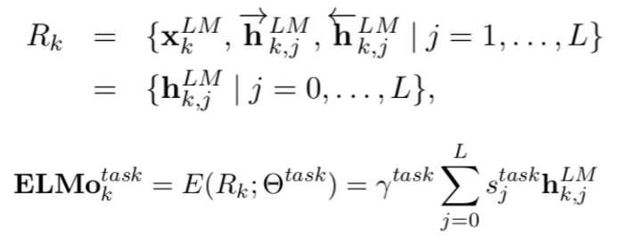
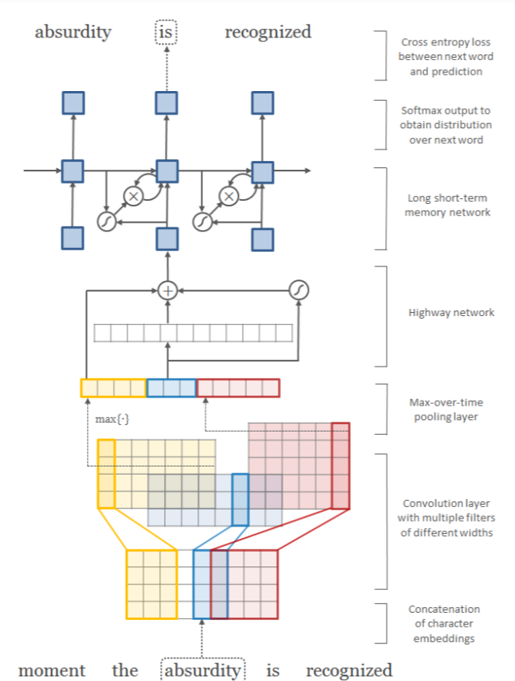

# ANLP Assignment 2

# Hitesh Goel

# 2020115003


## Complete Files can be downloaded from:

[Onedrive link](https://iiitaphyd-my.sharepoint.com/:f:/g/personal/hitesh_goel_research_iiit_ac_in/EsrQ--sAtY5OsEIMpqbTaWEB5DuAr4uvbiJyeCDDp-8mRw?e=cqnq5Q)

## Running commands:

For pretraining:
```bash
python preprocessing.py
```

For finetuning:
```bash
python preprocessing2.py
```

# Theory:

> Question 1.
> 
> 
> How does ELMo differ from CoVe? Discuss and differentiate both the strategies
> used to obtain the contextualized representations with equations and illustrations as
> necessary.
> 

## Ans:

CoVe and ELMo were both meant to generate contextual embeddings for words in a phrase.

The main idea behind CoVe was Imagenet and it was to solve more complex task which is meaning complete machine translation and then obtain embedding from encoder for them to use on simpler task. 

The purpose of ELMo was also the same i.e to solve meanign complete task but the case was in LM.

CoVe's initial constraint and an advantage for ELMo. Obtaining a parallel training corpus - a supervised dataset - for CoVe is difficult. 

It is challenging when language is not as popular as english but for elmo we have unsupervised dataset which is obtaintained from any language.



While CoVe employs glove embeddings for input global embeddings for words, ELMo expands on this concept by include character embeddings and a highway network. This highway network's job is to regulate contributions from word embeddings (glove) and character embeddings (obtained through convolutions). The next question goes into much information about this. This strengthens ELMo's resistance to "Out Of Vocabulary" terms.

### Architecture and Representation:

An attentional sequence to sequence model is used to train CoVe. The encoder is a two-layer MT-LSTM whose outputs serve as the attention model's key and value pairs.



A attentional decoder is employed. The decoder initially employs a two-layer, unidirectional LSTM to generate a hidden state hdect and a context-adjusted hidden state h_(t-1) based on the prior target embedding z_(t-1).



The downstream task representations for CoVe are the concatenation of the encoder's final layer BiLSTM and the glove embeddings.





---

---

ELMo word vectors are computed on top of a two-layer LSTM . This LSTM model has two layers stacked together. Each layer has 2 passes — forward pass and backward pass. 



They share embeddings. Words are predicted by passing hidden states to a linear classifier shared btw models.



The representation for ELMo is a weighted sum of each biLSTM layer (along with the embedding) scaled by a parameter. The downstream job can then fine-tune all of these weights and properties.



So as seen ELMo tries to overcome challenges faced by CoVe.

---

---

---

---

> Question 2.
> 
> 
> The architecture described in the ELMo paper includes a character convolutional
> layer at its base. Find out more on this, and describe this layer. Why is it used? Is
> there any alternative to this? [Hint: Developments in word tokenization]
> 

### Ans:

In paper they have described :

> The context insensitive type representation uses 2048 character n-gram convolutional filters followed by two highway layers (Srivastava et al., 2015) and a linear projection down to a 512 representation.
> 



The text is divided into words before being sent to the network, and each character is encoded as an integer value.

```cpp
1. Define set of characters that are acceptable to appear in words. Every char
	 is given one-hot encoding.
	 A word is just one hot encoding which is stacked together.
2. We define 1D Conv Kernel and pass through max pool layer.
3. The result from this kernel is concatinated and then passed through highway
	 network.
4. A highway network is layer where only one fraction of input is processed.
	 and remaining is passed unchanged. (what is passed unchanged is decided by 
	 gates)
	 One may also concatenate word embeddings from other global encoders, 
	 like as glove,and the highway network will learn how to integrate these things.
5. Finally, depending on the kernels used, we have an output of certain size. 
	 As a result, we add a linear layer to increase the size to 512.
```

## Why is it used:

```cpp
This type of representation has the following adv:
1. Out of vocabulary words, vectors may also be produced.
2. We get the best of both worlds if we concatenate words along with the acquired
	 char embeddings as input to highway networks.
3. It is superior than other global vector models in handling rare words.
4. It can handle misspellings, freshly created words that are a blend of others,
	 and potential emojis.
5. When chosen appropriately, it can lower the model's complexity.
6. It has been observed that a CNN can extract several interesting
	 properties in this manner.
```

## Alternatives:

```cpp
Char-based embeddings are an extreme form of the concept that not 
only words but also their subparts carry significance. Another thought 
is that while popular words can be included in the vocabulary, unusual 
terms can be divided into meaningful and often occurring subword tokens.
For this we have:
BPE Tokenization - makes vocab on the basis of # (freq)
WordPiece Tokenization - makes vocab on max likelihood of training data
These tokenizations may be used to substitute convolutions, allowing us
to use a single embedding layer to convert one hot vector of these tokens 
to their corresponding embeddings.
```

# Analysis

# Part-1 ELMo:

## Hyperparameter Tuning

## 1. Learning Rate

I start with LR = 1e-3. This shows descent result  for the models.

## 2. Optimizer

I tested two optimizers, Stochastic Gradient Descent (SGD) and Adam, and Adam performed well, therefore we continue to utilise it here.

## 3. Batch Size

Tried 32 and 64. But due to memory limit of gpu I have used 32 batch size.

## 4. No. of epochs

Model does not show much changes after 4-5 epochs. The max I have put for 10.

## 5. Loss

Because this is a multi-class classification problem, the optimizer utilised was Cross Entropy Loss, but the padding predictions were ignored.

## 6. Model Performance
Best Loss achieved on training set: 4.3064

# Part-2 Finetuning for classification task:

# Architecture and Pipeline:

- Sentence and label pairs
- Obtained emebeddings from ptretrained elmo
- Passed through and lstm and then a linear classifier

## Hyperparameter Tuning

## 1. Learning Rate

I start with LR = 1e-3. This shows descent result  for the models.

## 2. Optimizer

I tested two optimizers, Stochastic Gradient Descent (SGD) and Adam, and Adam performed well, therefore we continue to utilise it here.

## 3. Batch Size

Batch size is essentially 1. I am processing the sentences one by one.

## 4. No. of episodes

Model does not show much changes after 4-5 epochs. The max I have put for 10.

## 5. Loss

Because this is a multi-class classification problem, the optimizer utilised was Cross Entropy Loss, but the padding predictions were ignored.

## 6. Model Performance
Best loss achieved on training set: 0.829464
Accuracy on train set: 0.41135

Best loss achieved on test set: 0.86522
Accuracy on test set: 0.40062

Multilabel Confusion Matrix:

[[[34034 5966]
[5992 4008]]

[[34057 5972]
[5969 4002]]

[[34108 5962]
[5954 3976]]

[[33857 6063]
[6009 4071]]

[[33975 6006]
[6045 3974]]]

F1 score macro: 0.400615382
F1 score micro: 0.400619999
