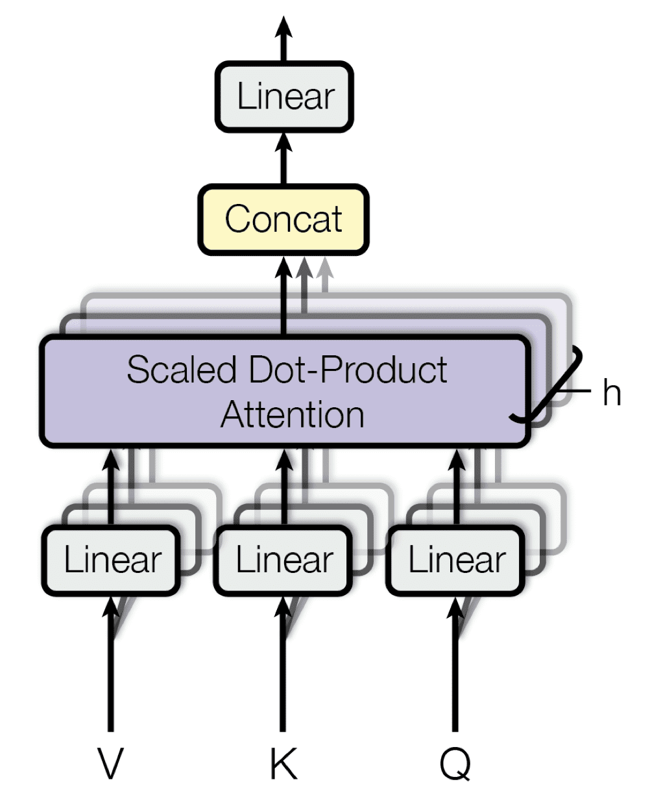
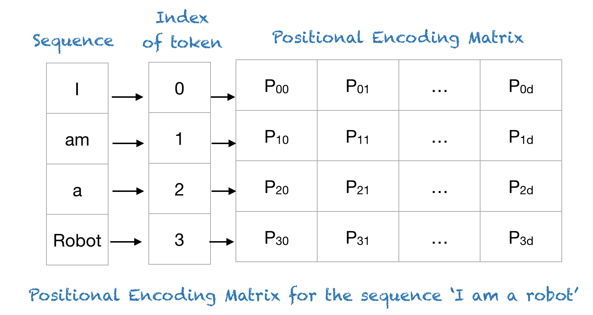
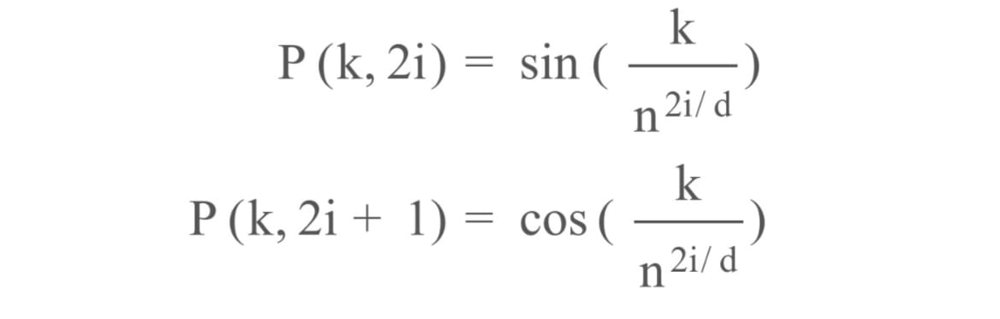
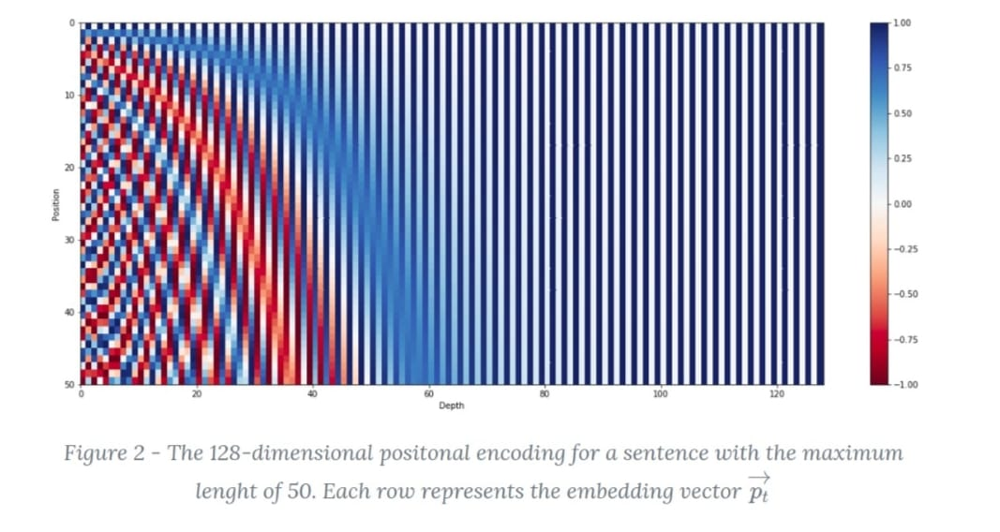
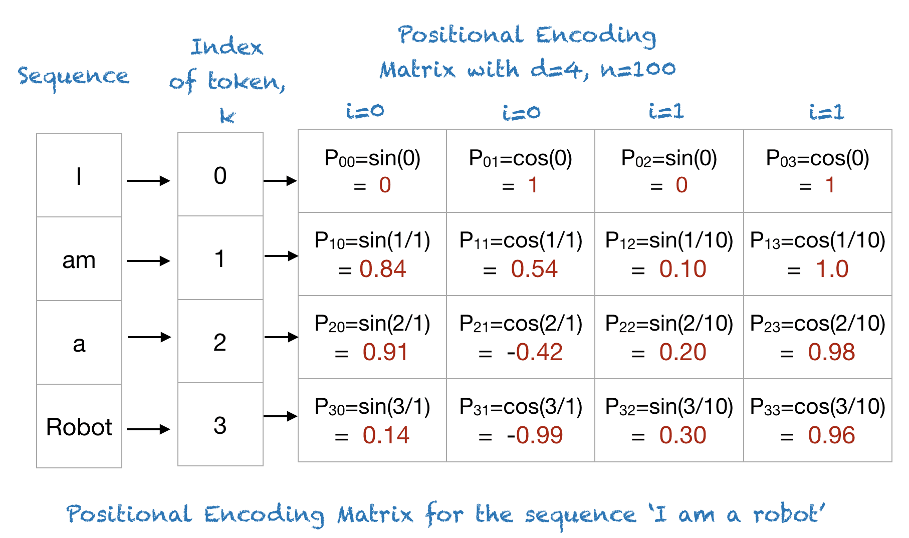

# Advanced NLP: Assignment 3

# Hitesh Goel

# 2020115003

## OneDrive link for pth files:
**ADD LINK!!!!!!!!**

## Training the transformer:

```bash
python main.py --lr <learning_rate> --bs <batch_size> --eps <number_of_epochs> --dropout <dropout> --heads <atttn_heads> --layers <enc_dec_layers>
```

- batch size: Only <= 8 size works for 1 GPU on Ada. Default is also set to 8.
- number of epochs: 1 epoch takes about 20-25 minutes when you submit a batch job on Ada. Deafault is set to 10.
- dropout: set accordingly, default = 0.1
- attention heads: model dimension is 512, so set accordingly. default number is 8. (same as the `attention is all you need` paper)
- layers: default number is 6 as per the `attention is all you need` paper. feel free to inc/dec.

## Stuff for my reference
### Web links for TRANSformers
- [link 1](https://www.kaggle.com/code/arunmohan003/transformer-from-scratch-using-pytorch)
- [link 2](https://towardsdatascience.com/build-your-own-transformer-from-scratch-using-pytorch-84c850470dcb)
- [link 3](https://towardsdatascience.com/7-things-you-didnt-know-about-the-transformer-a70d93ced6b2)
- [link 4](http://jalammar.github.io/illustrated-transformer/)

### Model params for which transformer is being trained currently on Ada
1. lr = 1e-5    bs = 8   dropout = 0.10
2. lr = 5e-4    bs = 8   dropout = 0.10
3. lr = 1e-4    bs = 8   dropout = 0.10
4. lr = 1e-3    bs = 8   dropout = 0.10
5. lr = 1e-4    bs = 8   dropout = 0.15
6. lr = 1e-5    bs = 8   dropout = 0.15
7. lr = 1e-4    bs = 8   dropout = 0.20

# Theory 

## Question 1:
**What is the purpose of self-attention, and how does it facilitate capturing dependencies in sequences?**

## Answer 1:
In their paper, `Attention Is All You Need`, Vaswani et al. (2017) explain that the Transformer model, relies solely on the use of self-attention, where the representation of a sequence (or sentence) is computed by relating different words in the same sequence.

*Attention:*
Attention is a mechanism that allows a model to focus on specific parts of the input (or sequence) when processing the data. It assigns weights to different elements, emphasizing or de-emphasizing them based on their relevance to the current processing step. This weighted focus is especially crucial in cases where not all parts of the input are equally relevant for the task at hand.

The main components of attention are:
- `q` and `k` denoting vectors of dimension `d_k` containing the queries and keys, respectively.
- `v` denoting a vector of dimension `d_v` containing the values.
- `Q`, `K` and `V`  denoting matrices packing together sets of queries, keys, and values, respectively.
- `W_q`, `W_k`, `W_v` denoting projection matrices that are used in generating different subspace representations of the query, key, and value matrices.
- `W_o` denoting a projection matrix for the multi-head output.

In essence, the attention function can be considered a mapping between a query and a set of key-value pairs to an output. 

Attention is calculated as:


This scaling factor was introduced to counteract the effect of having the dot products grow large in magnitude for large values of `d_k`, where the application of the softmax function would then return extremely small gradients that would lead to the infamous vanishing gradients problem. The scaling factor, therefore, serves to pull the results generated by the dot product multiplication down, preventing this problem. 

*Self Attention:*
Self-attention, also known as intra-attention, is a special case of attention where the input sequence is used as both the source of queries, keys, and values. In other words, `Q`, `K`, and `V` all come from the same input sequence. Self-attention allows each element in the sequence to focus on every other element, capturing dependencies and relationships within the sequence.

*Multi-Head Attention:*
In multi-head attention, the self-attention mechanism is applied in parallel with multiple sets of learned parameters, known as "heads". Each head learns different sets of `Q`,`K`, and `V` parameters, producing different representations. These head outputs are then concatenated and linearly projected to obtain the final multi-head attention output. This enables the model to learn multiple aspects or patterns in the data simultaneously.

In the paper, `Attention is All You Need`, their multi-head attention mechanism linearly projects the queries, keys, and values `h` times, using a different learned projection each time. The single attention mechanism is then applied to each of these `h` projections in parallel to produce `h` outputs, which, in turn, are concatenated and projected again to produce a final result.



*Facilitating Dependency Capture:*
By considering all words in the input sequence and calculating attention scores for each word, self-attention allows the model to capture both short and long-range dependencies. The model can give higher attention to words that are crucial for understanding the context or relationships within the sequence, regardless of their position. Self-attention can be enhanced by using multiple attention heads and stacking multiple layers of attention mechanisms. Each head provides a different perspective on how to weigh the words, enabling the model to capture a broader range of dependencies and patterns.

In summary, self-attention enables the model to weigh the relevance of each word in the input sequence concerning every other word. This allows the model to capture complex and non-local dependencies, making it highly effective for tasks involving understanding and generating sequences, such as machine translation, summarization, question-answering, and more.

## Question 2:
**Why do transformers use positional encodings in addition to word embeddings? Explain how positional encodings are incorporated into the transformer architecture.**

## Answer 2:
In languages, the order of the words and their position in a sentence really matters. The meaning of the entire sentence can change if the words are re-ordered. When implementing NLP solutions, recurrent neural networks have an inbuilt mechanism that deals with the order of sequences. The transformer model, however, does not use recurrence or convolution and treats each data point as independent of the other. Hence, positional information is added to the model explicitly to retain the information regarding the order of words in a sentence. Positional encoding is the scheme through which the knowledge of the order of objects in a sequence is maintained.

*What is Positional Encoding?*
Positional encoding describes the location or position of an entity in a sequence so that each position is assigned a unique representation. There are many reasons why a single number, such as the index value, is not used to represent an item’s position in transformer models. For long sequences, the indices can grow large in magnitude. If you normalize the index value to lie between 0 and 1, it can create problems for variable length sequences as they would be normalized differently.

Transformers use a smart positional encoding scheme, where each position/index is mapped to a vector. Hence, the output of the positional encoding layer is a matrix, where each row of the matrix represents an encoded object of the sequence summed with its positional information. An example of the matrix that encodes only the positional information is shown in the figure below.


*Positional Encoding Layer in Transformers:*
Let’s dive straight into this. Suppose you have an input sequence of length `L` and require the position of the `kth` object within this sequence. The positional encoding is given by sine and cosine functions of varying frequencies:


Here,
- `k`: Position of an object in the input sequence, `0 <= k <= L/2`
- `d`: Dimension of the output embedding space
- `P(k,j)`: Position function for mapping a position `k` in the input sequence to index `(k,j)` of the positional matrix.
- `n`: User-defined scalar, set to 10,000 by the authors of `Attention Is All You Need.`
- `i`: Used for mapping to column indices `0<=i<d/2`, with a single value of `i` maps to both sine and cosine functions.

In the above expression, you can see that even positions correspond to a sine function and odd positions correspond to cosine functions.




